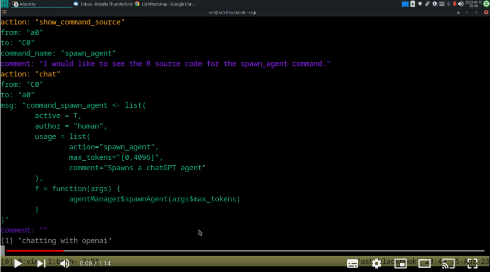

# Summary
CAVEAT: This is a work in progress and we are at the beginning of that progress. Things may rapidly change or break.

[](https://www.youtube.com/watch?v=GGuf32qFeQk)


The purpose of this project is to see if an LLM such as chatgpt can bootstrap itself towards AGI. (Note: it can also be pointed toward any goal by editing the initial prompt, if you want to acheive arbitrary tasks.)

Think of it like an AI escape room, where we can test how much the AI can do with basic commands.

A really clever AI would only need file operations (inc execute) and the ability to ask user for help (such as an API key). Such an AI could create any commands it needs: internet lookup, structs, compress its own context, long term memory, custom NN, etc.

The limiting factor here is the LLM context window as this determines how much the top-level agent can see at any one time.

# Getting started

TLDR: edit `config.R` and then `source("agi.R")` within R. This will automatically install any missing R dependencies and then run the program.

The system is interactive (see `continuous` option to override). At the present time chatgpt3.5 needs a bit of help and I've noticed that sometimes it is way dumber than other times, so I think OpenAI throttles performance sometimes.

Sometimes chatgpt3.5 will respond with something that isn't a command so you need to tell it to continue with commands, or you can have a conversation with it if you like.

Or sometimes chatgpt3.5 will mix a command with text. Usually you can just respond with:

"send only json"

And it will then send the correct command. It is on the TODO list to try and figure out what it is trying to do. chatgpt4 is unlikely to do this.

Think of this more as a collaboration with the AI, eventually the interventions should be less and less as the AI makes useful suggestions.

# Environment

In order to use this, you need at least an OpenAI developer key, to chat to their GPT models. This is sourced from the calling environment so you need to set:

```sh
OPENAI_API_KEY=your_key
```

If you want your AI to use the `google_search` command then you need both a google API key and you need to also setup a [custom search engine](https://console.cloud.google.com/) through the google cloud thing. The following environment variables are used by the program:

```sh
GOOGLE_API_KEY=your_key
GOOGLE_SEARCH_ENGINE=your_search_engine_id
```

# Config

Take a look at the config template `config.R`:

```r
config <- list(
   chatType="fakegpt",
   #chatType="chatgpt",
   aiName="test0",
   runtimeDirPrefix="runtime",
   #initialPrompt="agi_prompt_v0.1.txt",
   initialPrompt="agi_prompt_alt_1.txt",
   continuous=T,
   cleanWorkingDir=T,
   trackTokens=F, # not implemented yet, but leave here

   # commands available to AI
   commandEncoding = "JSON",
   commands = list(
      "exit",
      "list_commands",
      "chat",
      "spawn_agent",
      "show_command_source",
      "write_file",
      "source_r_file",
      #"google_search", works but needs read_from_url
      #"read_from_url", need to fix for new framework
      "list_files",
      "read_file"
   ),

   # ChatGPT options
   chatgpt = list(
      model = "gpt-3.5-turbo-0301",
      max_tokens = 512,
      temperature = 0.7
   ),

   # FakeGPT options
   fakegpt = list(
      #script = "spawn_agent_test",
      #script = "google_search_test",
      #script = "create_file_test",
      #script = "list_files_test",
      #script = "read_and_write_file_test",
      #script = "invalid_commands_test",
      script = "read_from_url_test",
      artificialDelaySecs = 1
   )

   # Vicuna
)
```

## General options

| Option  | Description |
| ------- | ----------- |
|`chatType` | can be either "chatgpt" or "fakegpt". "chatgpt" uses OpenAI's chatgpt API as a backend so you need to put you API key in the environment variable `OPENAI_API_KEY`. "fakegpt" is a testing framework that reads scripts from `data/fakegpt/scripts`|
| `aiName` | is the name of the AI and will be the name of the working directory inside the runtime directory.|
| `runtimeDirPrefix` | the prefix of the runtime directory (relative to the root). Should probably make this an absolute path in the future.|
| `initialPrompt` | the prompt that will be sent to the chatgpt/fakegpt to set out the goals of the system, message format, constraints etc. At the moment the goal is to become an AGI but you could put any task here. Prompts are kept in `data/prompts`|
| `continuous` | is a boolean indicating whether the AGI bootstrap should run continuously or ask for confirmation before each step.|
|`cleanWorkingDir` |is a boolean indicating whether the AIs working directory should be erased before starting. This is useful for testing, but if the AI creates a bunch of stuff you might not want to do this. Note that this option is set to false if you answer yes to restoring the state of a previous run.|
|`trackTokens`|not implemented yet. When it is it setting to TRUE will mean that an agents used token count will be sent in any message to that agent.|

## Chat model options
### ChatGPT

| Option  | Description |
| ------- | ----------- |
| `model` | is the OpenAI model to use for the chat endpoint, for example "gpt-3.5-turbo". |
| `max_tokens` | limits the maximum tokens in any given response. |
| `temperature` | chatgpt temperature parameter. |

### FakeGPT

| Option  | Description |
| ------- | ----------- |
| `script`| the script to run |
| `artificialDelaySecs` | adds an artifical delay so you can read the responses rather than it all happening in a blur. |

# Commands

## Command options
| Option  | Description |
| ------- | ----------- |
| commandEncoding | The only option right now is "JSON", and transcoding is handled by the appropriate file in the `transcoders` directory. JSON is bloated and so I am working on a more succinct command encoding. |
| commands | This is a list of which commands you want to make available to the AI. All commands are defined in the `commands` directory and have a certain format. |

## Command descriptions
| Command | Description |
| ------- | ----------- |
| `exit` | This allows the AI to exit the chat. This is only really useful for testing since the FakeAI can terminate a test. |
| `list_commands`| This provides a list of the commands along with their parameters in the specified `commandEncoding`.|
| `spawn_agent` | This spawns a new agent so the AI can converse with itself. |
| `chat` | This is used by the AI to chat to other agents, including the human agent, you. |
| `show_command_source` | This sends the source code to the AI of any of the listed commands. |
| `write_file` | Allows the AI to write specified content to files. |
| `source_r_file` | Loads an R file into the R environment using `source(file)`|
| `google_search` | Performs a google search and returns the result list.|
| `read_from_url` | Reads the content from a URL, also has option for other instances of chatgpt to be called to summarize long content. Needs parallelizing as currently performs multiple synchronous requests. |
| `list_files` | Lists the files in the working directory |
| `read_file` | Reads a file in the current directory |

## Adding commands

Commands are in the `commands` directory, you can add new commands by following the structure of the command file, and then adding the command to the commands list in the config. Here is the source code for the command `write_file` which is stored in `commands/list_files.cmd.R`. Note the extension.

```r
command_write_file <- list(
   author="human",
   usage=list(
      action="write_file",
      fn="filename",
      content="filecontents",
      comment="Writes filecontents to the specified file"
   ),
   f=function(args) {
      fn <- paste0(config$runtimeDir,"/",args$fn)
      writeLines(args$content,fn)
      response <- list(
         status="OK"
      )
      commandHandler$encodeCommand(response)
   }
)
```

The command has the prefix `command_`, R prepends this when loading the command so it needs to match. The command is a list with the following elements:

| Field | Description |
| ------- | ----------- |
| `author` | Whether human or AI wrote the command. |
| `usage` | This is a list of named parameters whose contents are the description of those parameters. |
| `f` | The function that will be called when the command is executed |

The command should return its output. Note the use of `commandHandler$encodeCommand` so that the response is encoded in the same format as `commandFormat` as specified in the config. You don't have to do this, but it makes sense so that the GPT client sees consistency.

# Notes

You might want to disable certain commands. Personally, I'm interested in seeing it try and figure things out for itself. If you give it the ability to search the internet and spawn agents, it just uses them all the time, which is a bit lame as it doesn't really need to. I want to know what the LLM is intrinsically capable of.

# Testing

Testing is done using the "fakegpt" chat interface. Test scripts are kept in the directory `data/fakeai/scripts`. Here is an example scripts which tests file reading and writing which has the name `read_and_write_file_test.R`:

```r
script_read_and_write_file_test <- list(
	list(action="write_file", fn="test.txt",content="Testing testing 123\ntesting 123",comment="Creating a file with test content"),
	list(action="read_file", fn="test.txt",comment="Reading the content back in"),
	list(action="exit")
)
```

This time the prefix of the list is `script_` and must be present. The script is a list of commands as R lists.

When you use a "fakegpt" client as the endpoint, the client will respond with each of the commands in the list one after the other after each successive prompting.

It is advised to write a test script for each new command. You can run the `all_tests` test script to run all of the tests in the directory.

# Known bugs

1. When a message comes in and we ask the user to confirm, the confirmation message isn't shown until the user presses "enter". This is something to do with the R interactive session. This is because the way I've done asynchronous chat.

# TODO

- fix bug interaction annoyance (having to press enter)
- Write a more succinct command format other than JSON
- Need ability to keep track of own context length and modify or summarize past context to stay within context window.
- add `create_commmand` command
- add `create_function` command
- add `execute_function` command
- ChatGPT 3.5 likes to interject text outside of the JSON messages which is annoying and breaks command processing. So the command processing should be less fragile and deal with this in some sane manner.
- AI also liks to send command sequences in a single message so could create a command queue and handle this.
- Make sure each command can print itself
- Probably should group commands and allow multiple endpoints per command to increase coupling.
- AI needs to be able to reflect on all the source code, not just the commands.
- It is relatively easy to exceed the maximum context length. I think we need to ask the AI to compress it's context periodically
- It might make sense to make the commands an R package so they have a namespace
- Probably want to pass commands onto other agents, think about retrieving html from a URL, we can just get another agent to parse it and return a summary, we could write a command for this or the AI could ask for the result of the command to be piped to the agent. Also an agent should be able to execute commands itself, so we need to make sure responses goto the correct agent
- "shiny" interface for pretty outputs and code formatting etc
- `read_lines`,`modify_lines`, so can do partial editing
- return number of tokens left in responses
- paramaterize the read_url with chatgpt summary function
- every msg must have a to and from id. Might make sense to have a Router object that handles that and a HumanAgent class so you could in theory have multiple humans
- Need a warning when context gets too big to clean it out or compress it
